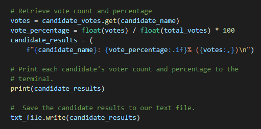

# Election-Analysis

## Project Overview
The colorado Board of Elections has identified a need for a program that retreives election data and performs an audit of the states' most recent congressional election. The following is a list of requirements as stated by the Board:

    1. Calculate the total number of votes cast in the election. 
    2. Calculate the total number of votes cast by county with each counties' respective percentage of total votes.
    3. Calculate the county with the highest total voter turnout.
    4. Form a complete list of candidates that received votes.
    5. Calculate the total votes for each candidate with each candidates respective percentages of the total vote. 
    6. Determine the winner of the election and display their total votes with the respective percentage of the total votes.
___

## Resources
* Data Source: election_results.csv
* Software: Python 3.6.1, Visual Studio Code 1.65.2
___
## Summary
*PyPoll_Challenge.py* uses the raw election data provided by the board in *election_results.csv*. The program imports the file for analysis and outputs the final results to a text file labeled *election_analysis.txt*. The analysis of the raw election data show:

* There were **369,711** votes cast in total.

* Contributing counties (*Note that **Denver County** had the largest contribution*) :
    - Denver: **306,055** votes (*82.8%*)
    - Jefferson: **38,855** votes (*10.5%*)
    - Arapahoe: **24,801** votes (*6.7%*)
    

* The candidates that received votes:
    - Diana DeGette: *272,892* votes (**73.8%**)
    - Charles Casper Stockham: *85,213* votes (**23.0%**)
    - Raymon Anthony Doane: *11,606* votes (**3.1%**)
    

* The winner of the election is candidate **Diana DeGette** with **272,892** votes (*73.8% of total vote*).

The results of the election are extracted from the raw data through the usage of the *csv* module of python. Importing this module allows *PyPoll_Challenge.py* to read the comma separated values in *election_results.csv*. From this point, the program can interpret the data by using a for loop to comb through each row of the data to collect important information such as the candidate voted for, the county in which the voter resides and the total number of votes in the election. All of this information is added to its own corresponding variable/list/dictionary to be referenced later. Below is an included example of code that uses multiple data types as place holders to calculate the number of votes and percentage of total votes for a given candidate. 

The program uses dictionaries to hold the tallied votes with their corresponding candidate. It references the dictionary to ask for the number of votes that corresponds with a candidate to calculate their percentage of total votes. It then prints the results of the calculation to the terminal and writes it to the *election_results.txt* document. 

## Proposal
*PyPoll_Challenge.py* completes all the requirements identified by the Election Board. However, the way in which the script is written allows for it to be used to tabulate the results of any election with very little modification. This is due to the program's use of lists and dictionaries to store and reference values rather than refering to the specific data that was provided. With minor modifications to the lists and dictionaries, the script could be used to tabulate election results for state/country-wide elections while still providing the same precision on a county to county basis. The code can be refactored with nested dictionaries to hold state, county, or voting district information to tabulate results that range from state averages down to singular voting district percentages. This versatility can also stretch beyond elections with just a single winner. Often in local elections, the ballots contain multiple categories to be voted on such as propositions or other positions of office. The existing program can be modified with the addition of code that follows the same structure as the pre-existing script with added dictionaries to store and tabulate ballots with multiple criterion to be voted on. 

